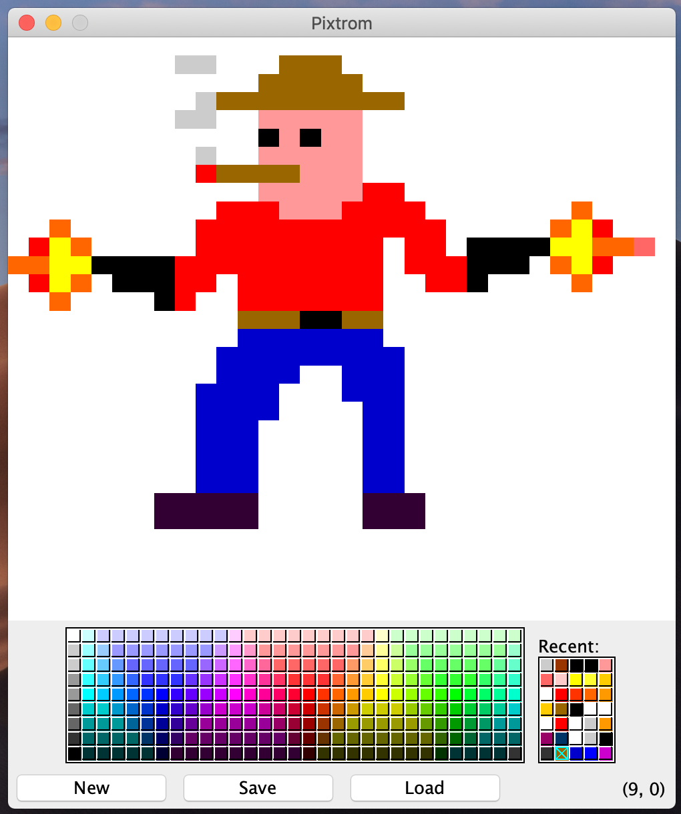

# Pixtrom
Pixtrom is a pixel art editor i put together to make something more concrete with Java. It is still a work in progress with new features being added continuously. Pixel editing skills not included with app.

## Some todos
* Saving/loading.
* Different PixelGrid sizes.
* Eraser.
* Better color chooser.
* A little shading between pixels.
* Menubar?
